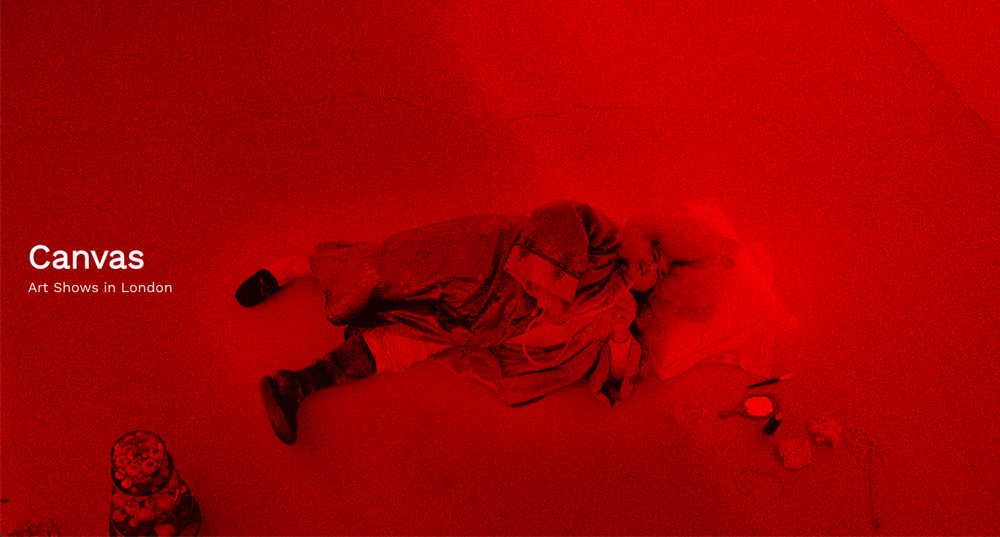
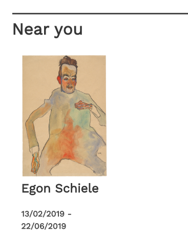
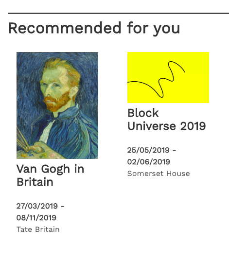
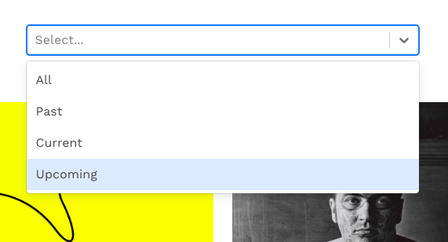
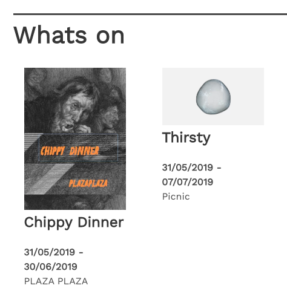
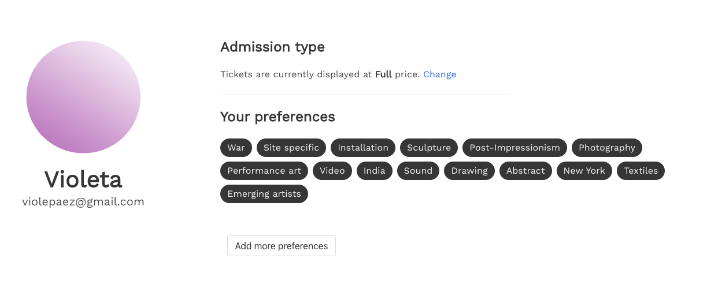
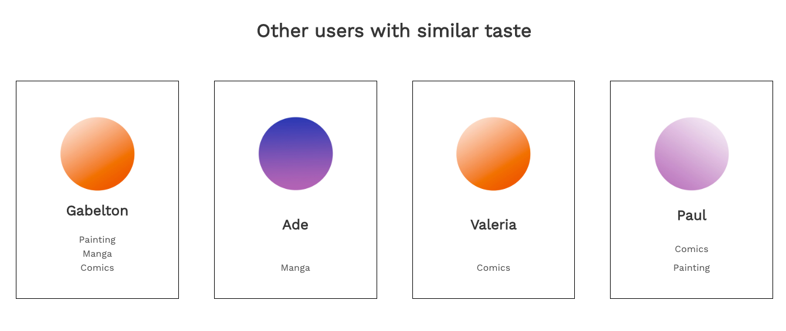

# Canvas
## Art shows in London




Canvas showcases art exhibitions and events in London, based on user preferences and location.
[Link to Live Website](https://canvas-london.herokuapp.com)

## Timeframe
7 days

## Technologies used

* React
* PostgreSQL
* Bulma
* SCSS
* Webpack
* Pipenv and yarn
* Git
* Ajax
* Python
* Flask
* PonyORM
* Marshmallow
* OpenCage API
* Mapbox API


## Installation

* Clone or download the repo
* `yarn` and `pipenv install` to install dependencies
* `createdb art-london` to create database using postgress
* `yarn run server` to run backend
* `yarn run client` to run front-end


## Introduction

Week long project in collaboration with Violeta Paez.

At university we both came into regular contact with the art world. London possesses a dizzying range of galleries and events. Sometimes sifting through these different options can feel a touch overwhelming. Working as part of a pair, we designed an app to help users filter art events around the city, making use of a ‘keywords’ model to connect users with similar taste and to provide tailored recommendations based on their interests.

Initially we divided responsibilities across the front and back ends. I was excited by Python and so took the lead in creating our initial models, as we worked towards our minimum viable product. After we reached this point, however, we swapped over roles, adding a new artist model on the backend, while I got the opportunity to use Mapbox for the first time and work on filtering events by date, which required me to adapt the models on the backend while working with Javascript’s sometimes unwieldy Date functionality on the front end. I then focused on the ‘events near you’ section of the homepage, the first time I had been required to make third party API requests from the back end.


## Personalised/Tailored Results

The different exhibition lists on canvas respond to the user. They're based on their location and their set preferences.


## Based on location


This section required us to carefully rethink our initial approach and adopt a new strategy. At first we had tried to handle requests from the front end only, though we began to realise that this was an inefficient system, which quickly consumed Opencage API requests. At this point we opted to set location as a property in the backend, the first time we had used ‘before_insert’ and ‘before_update’ hooks, and to write conditions in Python to check that the requests had been successful.

```
def geolocate(record):
    params = {
        'q': record.venue,
        'key': os.getenv('OPENCAGE_KEY')
    }
    try:
        res = requests.get('https://api.opencagedata.com/geocode/v1/json', params)
        print(res)
        json = res.json()


        if json['results']:

            record.lat = json['results'][0]['geometry']['lat']
            record.lng = json['results'][0]['geometry']['lng']
        else:
            record.lat = 51.509865
            record.lng = -0.118092
```

## Based on taste



The user has associated keywords (preferences that they set when registering or in their profile page) stating their taste in art (performance art, painting, photography). On componentDidMount, we made an axios request to our own api to fetch the user's preferences (this.state.keywords) and the exhibitions (this.state.exhibitions). The function matchedEvents checks filters any exhibition that matches any of the user's keywords. We had to use an includes() function within the filter because the user can have many keywords and the exhibitions can have many keywords as well.


```
matchedEvents(){

  const exhibitions = this.state.exhibitions
  return exhibitions.filter(exhibition => {
    const match = exhibition.keywords.filter(keyword =>{
      if(this.state.keywords.includes(keyword.id)) return keyword
    }).length
    if(match) return exhibition
  })
}

```

## Based on date



This section was somewhat challenging because we had not worked with dates in Python before. We had to import functionality from datetime in our seeds file before employing the strftime() method. On the frontend we then had to translate this string into a format JavaScript recognised as a date before parsing this date, so that we could compare different results and filter according to whether they were past, current or upcoming exhibitions using React Select.



```
function whatsOn(arr) {
  return arr.filter(exhib => {

    const startSplitDate = exhib.start_date.split('/')
    const startMonth = startSplitDate[1] - 1
    const startDate = new Date(startSplitDate[2], startMonth, startSplitDate[0])

    const endSplitDate = exhib.end_date.split('/')
    const endMonth = endSplitDate[1] - 1
    const endDate = new Date(endSplitDate[2], endMonth, endSplitDate[0])

    const startParsed = Date.parse(startDate)
    const endParsed = Date.parse(endDate)
    const currentParsed = Date.parse(new Date())

    if (currentParsed > startParsed && currentParsed < endParsed ){
      return exhib
    }
  })
}
```


## User Profile

Because customisation based on the user was really important to our project, we dedicated a substantial amount of time to develop a user profile page where the users could see events created by them, view and edit their preferences and see other users with same preferences. The user can also choose to see ticket prices displayed on the exhibition at full or concession price.



```
@router.route('/me', methods=['PUT'])
@db_session
@secure_route
def edit_profile():

    schema = UserSchema()
    data = request.get_json()
    if data.get('concession'):
        data['concession'] = data['concession'] == 'true'
    if data.get('keyword_ids'):
        print(g.current_user.keywords)
        previousKeywords = []
        for keyword in g.current_user.keywords:
            previousKeywords.append(keyword)
        data['keywords'] = [Keyword.get(id=keyword_id) for keyword_id in data['keyword_ids']] + previousKeywords
        del data['keyword_ids']
    g.current_user.set(**data)
    db.commit()
    user_info = g.current_user
    return schema.dumps(user_info)
```



```
@router.route('/contacts', methods=['GET'])
@db_session
@secure_route
def get_contacts():

    def intersection(listA, listB):
        return list(set(listA) & set(listB))

    users = User.select()
    users = [u for u in users if intersection(u.keywords, g.current_user.keywords) and u != g.current_user]
    print(users)


    def get_keywords(keywords):
        keywords = [{'id': keyword.id, 'name': keyword.name} for keyword in keywords if keyword in g.current_user.keywords]
        return keywords

    users = list(map(lambda user: {'username': user.username, 'matches': get_keywords(user.keywords), 'id': user.id, 'avatar': user.avatar}, users))

    return jsonify({'users': users})

```

## Future Features

### Messaging service

Messaging service using a third-party API to connect the user with users with similar taste.

### More accurate map results

Implement an option for when the user is creating a new event, to double check the position in the map, before setting the address for the event. This would fix a small issue with the wrong coordinates being set for the event location, as certain galleries not being recognised by OpenCage API.

### Incorporating museums API

We would also like to do some more research into the current state of museum APIs and how these might supplement our artist model.

### Responsiveness

We still need to add classes in Bulma to make certain elements, such as the Navbar, display on mobile. We also need to modify the main image on the homepage, so that it displays fully on a projector or large screen.
